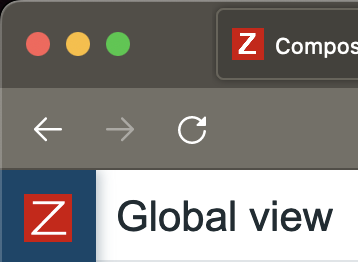
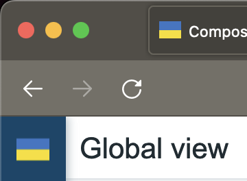

# zabbix-module-logo
Written according to Zabbix official documentation <https://www.zabbix.com/documentation/current/manual/modules>

A Zabbix module to replaces 'Z' in favicon and in main menu when it is in compact mode.

The look without the module:
Teste 

#

The look with the module installed and activated:

#

